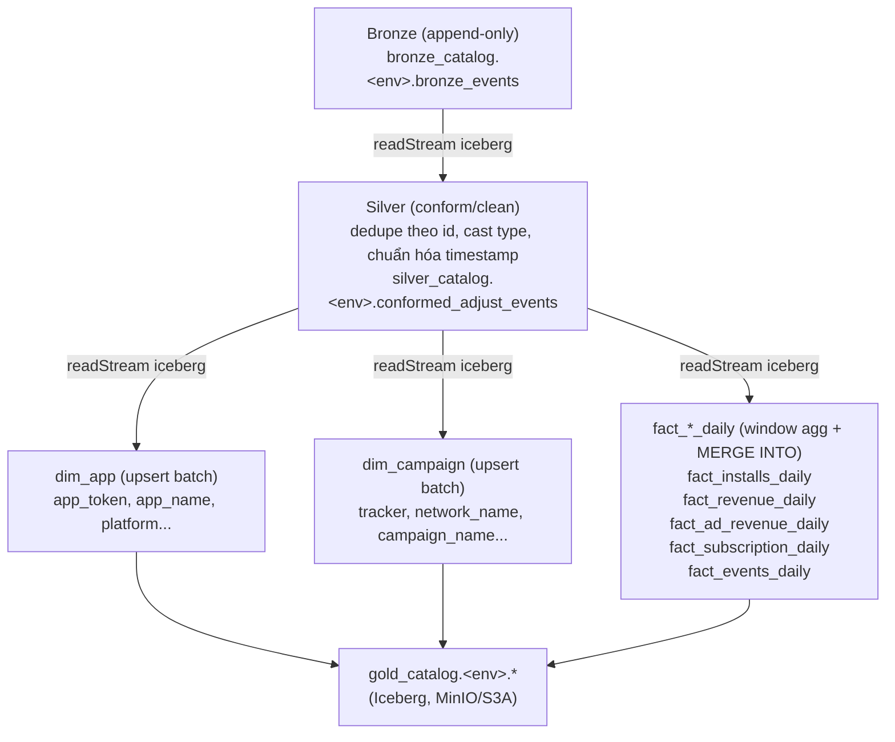

# Adjust Streaming Project

Pipeline dữ liệu streaming mô phỏng sự kiện attribution kiểu Adjust (install, ad revenue, subscription), lưu vào Postgres, đẩy CDC qua Kafka/Debezium, rồi Spark Structured Streaming ghi vào bảng Iceberg (bronze layer).

## Kiến trúc

```
simulator (FastAPI) --> Postgres (schema adjust) --> Debezium (kconnect) --> Kafka cluster (3 broker) --> Spark Structured Streaming --> Iceberg (bronze_events, trên MinIO/S3A)
```

- **simulator** — FastAPI service sinh sự kiện install/ad-revenue/subscription ngẫu nhiên, ghi vào bảng `adjust.event` trong Postgres.
- **postgres** — lưu raw event, chạy với `wal_level=logical` để Debezium đọc được WAL.
- **kafka1/kafka2/kafka3** — cluster Kafka 3 broker chế độ KRaft (không dùng ZooKeeper).
- **kconnect** (Debezium) — bắt thay đổi từ Postgres qua CDC, publish vào topic Kafka `adjust-dbserver.adjust.event`. Connector không tự đăng ký khi start, xem [Setup](#setup) bước 4.
- **kafka-ui** — UI xem topic Kafka và trạng thái connector Debezium.
- **minio** — object storage tương thích S3, dùng làm Iceberg warehouse (`s3a://lakehouse`) và nơi lưu checkpoint Spark Structured Streaming (`s3a://data/checkpoints/...`).
- **minio-init** — service chạy 1 lần lúc `docker compose up`, tạo sẵn 2 bucket `lakehouse` và `data` trên MinIO (idempotent, an toàn khi chạy lại).
- **spark-master / spark-worker-1 / spark-worker-2** — chạy job Spark Structured Streaming ([spark/bronze/sink_to_bronze.py](spark/bronze/sink_to_bronze.py)) đọc từ Kafka, ghi (append-only) vào bảng Iceberg `bronze_catalog.<env>.bronze_events`, partition theo `event_date`. Thư mục `spark/silver` và `spark/gold` hiện chưa có job nào (placeholder).
- **spark-history-server** — Spark History Server, đọc event log để xem lại các job đã chạy.

### Kiến trúc tầng Gold

Bronze lưu raw event append-only; Silver làm sạch/conform; Gold là các bảng tổng hợp phục vụ trực tiếp câu hỏi nghiệp vụ (revenue, install, campaign performance...), theo mô hình star-schema rút gọn:



- **Silver** — một job streaming đọc lại Bronze qua Iceberg (`spark.readStream.format("iceberg")`), dedupe theo `id`, ép kiểu, chuẩn hóa timestamp; ghi append vào bảng Iceberg riêng, vẫn partition theo `event_date`.
- **Gold — dimension tables** (`dim_app`, `dim_campaign`) — ít thay đổi, cập nhật dạng upsert (`foreachBatch` + Iceberg `MERGE INTO`) từ Silver.
- **Gold — fact tables** (`fact_*_daily`) — đọc Silver streaming, `groupBy(window(...), keys).agg(...)` với watermark, ghi qua `foreachBatch` + `MERGE INTO` (không dùng `outputMode("append").toTable()` như bronze, vì mỗi micro-batch có thể cập nhật lại số liệu của cùng một ngày).
- Việc chạy các job này được điều phối qua `CONFIG_JOBS` trong [spark/spark_builder.py](spark/spark_builder.py) — mỗi phần tử `layer.job` trỏ tới một `config.yaml` + module `run(spark, config)` tương ứng trong `spark/<layer>/`.

## Setup

1. Copy `.env.example` thành `.env` và điền giá trị (gồm cả credentials MinIO: `AWS_ACCESS_KEY_ID`, `AWS_SECRET_ACCESS_KEY`, `S3_ENDPOINT`).
2. `make up`
3. Chạy init DDL trên Postgres.
4. `make register-connector` để đăng ký connector Debezium (không persist — phải chạy lại sau khi teardown/wipe volume). Kiểm tra: `make connector-status` hoặc xem trong Kafka UI (http://localhost:8088 → Kafka Connect → debezium).
5. Submit job Spark: `make spark-submit SPARK_LAYER=bronze SPARK_JOB=sink_to_bronze` (đọc credentials MinIO từ `.env`, truyền vào container qua `-e` lúc exec).

## Ports

| Service | Port | Ghi chú |
|---|---|---|
| Postgres | 5434 | map vào 5432 trong container |
| Kafka (broker 1/2/3) | 9092 / 9094 / 9096 | |
| Kafka Connect (Debezium) | 8083 | |
| Kafka UI | 8088 | |
| Simulator (FastAPI) | 8000 | |
| Spark master UI | 7070 | map vào 8080 trong container |
| Spark master RPC | 7077 | |
| Spark driver UI | 4040 | chỉ lên khi có job đang chạy |
| Spark worker 1 UI | 8091 | |
| Spark worker 2 UI | 8092 | |
| Spark History Server | 18080 | |
| MinIO API | 9000 | S3-compatible endpoint |
| MinIO Console | 9001 | user/pass = `MINIO_ROOT_USER`/`MINIO_ROOT_PASSWORD` |
